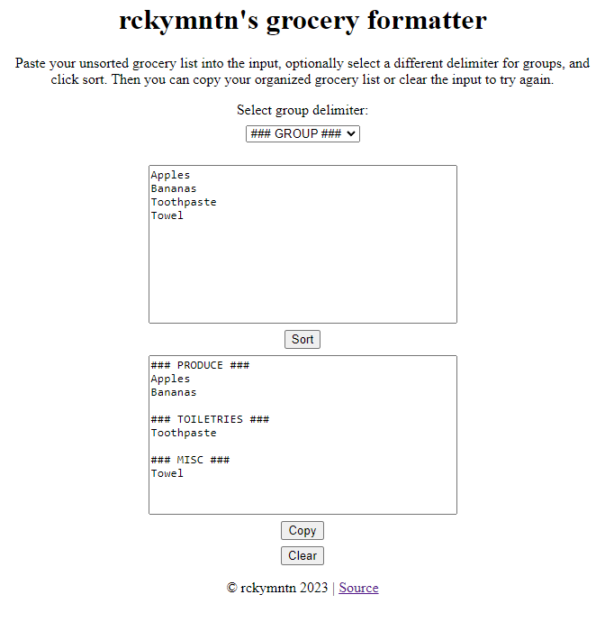

# grocery-formatter 

A simple webpage that groups an unsorted list of groceries into their departments. Does this exist already? Certainly, but I didn't look because I wanted to build my own tailored to how I would like things grouped. 

The bulk of this was written in a couple hours before a grocery shopping trip as a proof of concept to myself. This is very bare bones right now with plenty more that could be done.

### Usage

1. Visit the [GitHub Pages deployment](https://rckymntn.github.io/grocery-formatter/).
2. Optionally select a different grouping delimiter.
3. Write or paste your grocery list and click sort.
4. Your grocery list is now sorted and you can copy it to wherever you store your grocery lists. 

### To do

- Organize groceries into maps to use `.has()` rather than arrays using `.includes()` for better performance. 
    - Alternatively: Use a readonly sqlite database. 
- Find an existing dataset of groceries by department.
- ~~Give some love to the frontend to make the webpage more visually appealing.~~ Done for now with plain and simple vanilla CSS. 

